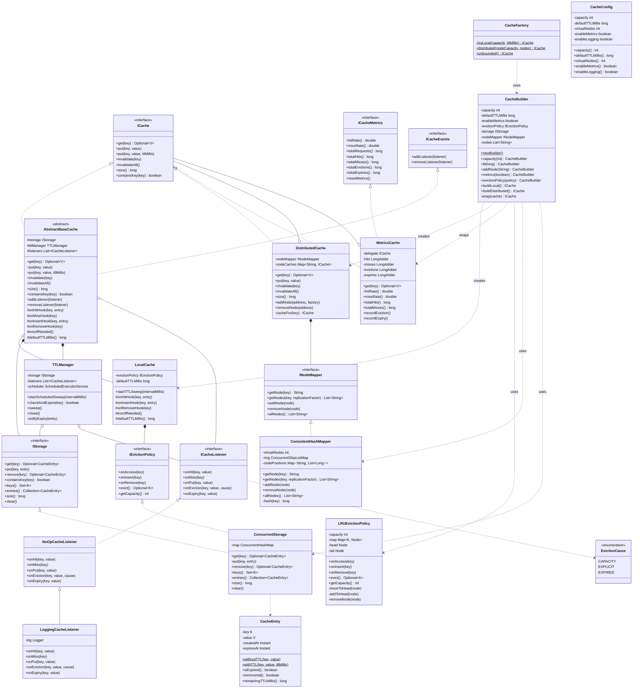

# Distributed Cache Design Patterns

A Java implementation of a distributed in-memory cache demonstrating SOLID principles and classic design patterns including Builder, Factory, Decorator, Strategy, Observer, and Consistent Hashing.

---

## Features

- **LRU Eviction** — doubly-linked list + hash map for O(1) eviction
- **TTL Expiry** — per-entry expiration with optional background sweep
- **Distributed Mode** — consistent hashing across virtual nodes
- **Metrics** — hit rate, miss rate, evictions, expiries via Decorator
- **Events** — pluggable listener system (Observer pattern)
- **Fluent Builder API** — `CacheBuilder` + `CacheFactory` presets

---

## Class Diagram



---

## Package Structure

```
src/
├── Main.java
├── api/
│   ├── ICache.java            # Core cache interface
│   ├── ICacheMetrics.java     # Metrics interface
│   └── ICacheEvents.java      # Listener registration interface
├── service/
│   ├── AbstractBaseCache.java # Template Method base
│   ├── LocalCache.java        # LRU + TTL local cache
│   ├── DistributedCache.java  # Consistent-hash sharding
│   └── MetricsCache.java      # Decorator: metrics tracking
├── storage/
│   ├── IStorage.java          # Storage abstraction
│   ├── ConcurrentStorage.java # ConcurrentHashMap impl
│   └── CacheEntry.java        # Value wrapper with TTL metadata
├── eviction/
│   ├── IEvictionPolicy.java   # Eviction strategy interface
│   └── LRUEvictionPolicy.java # Doubly-linked list LRU
├── distribution/
│   ├── INodeMapper.java       # Node routing interface
│   └── ConsistentHashMapper.java # MD5-based virtual ring
├── ttl/
│   └── TTLManager.java        # TTL check + scheduled sweep
├── events/
│   ├── ICacheListener.java    # Observer interface
│   ├── EvictionCause.java     # Eviction reason enum
│   ├── NoOpCacheListener.java # No-op base
│   └── LoggingCacheListener.java # java.util.logging impl
└── factory/
    ├── CacheBuilder.java      # Fluent builder
    ├── CacheFactory.java      # Static preset factory
    └── CacheConfig.java       # Immutable config value object
```

---

## Design Patterns Used

| Pattern | Where |
|---|---|
| **Builder** | `CacheBuilder` — fluent API for constructing any cache variant |
| **Factory Method** | `CacheFactory` — static presets (`lruLocal`, `distributed`, `unbounded`) |
| **Decorator** | `MetricsCache` wraps any `ICache` to add metrics without changing behaviour |
| **Template Method** | `AbstractBaseCache` defines the algorithm skeleton; subclasses override hooks |
| **Strategy** | `IEvictionPolicy` — swap LRU for any eviction algorithm at construction time |
| **Observer** | `ICacheListener` / `ICacheEvents` — fire-and-forget event callbacks |
| **Consistent Hashing** | `ConsistentHashMapper` — MD5 virtual node ring for stable key routing |

---

## Quick Start

```java
// Local LRU cache with TTL and metrics
ICache<String, String> cache = CacheBuilder.<String, String>newBuilder()
        .capacity(1000)
        .ttl(60_000)          // 60s TTL
        .metrics(true)
        .buildLocal();

cache.put("key", "value");
cache.get("key");             // Optional.of("value")

// Distributed across 3 nodes
ICache<String, String> dist = CacheBuilder.<String, String>newBuilder()
        .capacity(500)
        .addNode("node1:6379")
        .addNode("node2:6379")
        .addNode("node3:6379")
        .metrics(true)
        .buildDistributed();

// One-liner presets
ICache<String, String> lru  = CacheFactory.lruLocal(1_000, 60_000);
ICache<String, String> dist = CacheFactory.distributed(500, "node1", "node2");
```

---

## Running

```bash
javac -sourcepath src -d out src/Main.java
java -cp out Main
```
